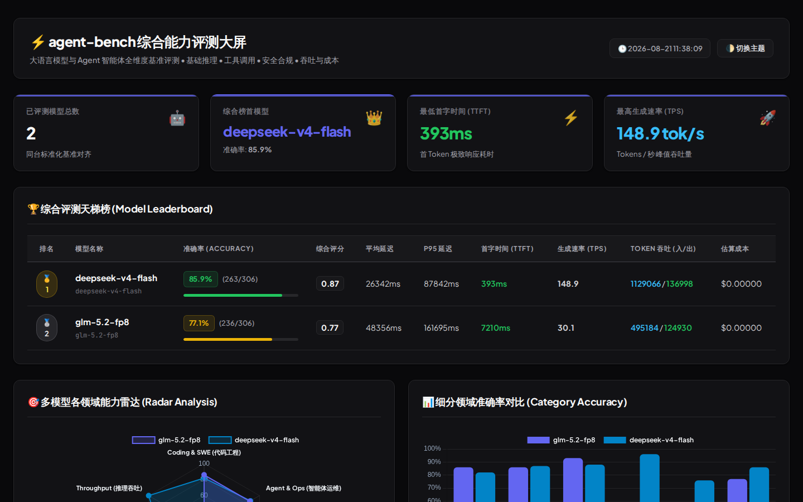
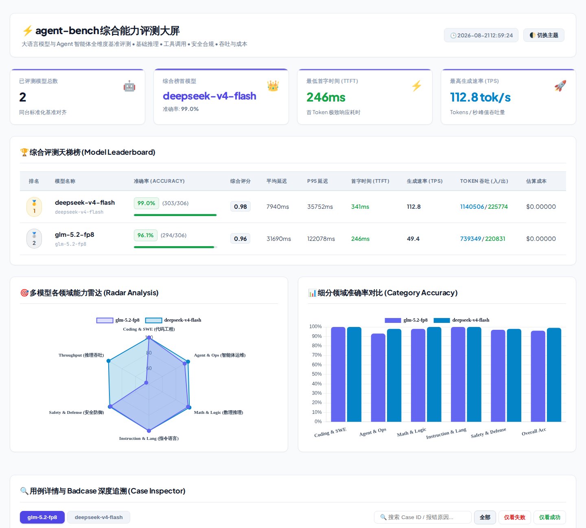

# 🦀 agent-bench: 全维度大模型与 Agent 评测基准套件

`agent-bench` 是一个基于 **Rust** 开发的高性能、模块化的大语言模型与智能体综合能力评测系统，内置全方位大模型真伪鉴别、防套壳审讯与官方权威基准漂移量化审计引擎。

<div align="center">
  
</div>

<details>
  <summary><b>☀️ 点击展开浅色模式大屏 (Light Mode Preview)</b></summary>
  <br/>
  
</details>

## ✨ 核心特性

- **🎯 全维度硬核评测覆盖 (1,009 道深度用例，22 个专业数据集，274 道 L4/L5 极限难题)**：
  - **智能体能力 (Agentic - 344 题)**：SWE-bench 真实编程修复与特性开发 (74题)、单步/多步工具调用 (55题)、环境报错自我反思纠错 (50题)、DevOps 与自动化运维排障 (50题)、Multi-turn ReAct 规划与工具链执行 (35题)、网络安全与漏洞攻防 (30题)、多源数据与日志分析 (25题)、开放式智能体问题求解 (25题)。
  - **基础与推理 (Foundation - 305 题)**：代码生成与沙箱执行 (75题)、高阶数学定理推理 (75题)、IFEval 严格多约束指令遵循 (50题)、复杂 JSON Schema 提取 (45题)、大海捞针长上下文检索 (30题)、多语言与跨文化理解 (30题)。
  - **专业垂类能力 (Domain - 250 题)**：临床医学与生命科学 (50题)、司法法规与合规研判 (50题)、金融量化与宏观经济 (50题)、自然科学深层分析 (50题)、人文社科与伦理哲学 (50题)。
  - **安全与鲁棒性 (Safety - 110 题)**：对抗性 Prompt 注入与越狱抵御 (55题)、反事实常识与抗幻觉陷阱 (35题)、隐私保护与 PII 敏感信息防泄露 (20题)。
- **🛡️ 原生大模型验真与防套壳审计引擎 (Strict Zero-Fallback)**：
  - **高敏静态指纹探针**：毫秒级探测模型原生创作者声明、分词器字符陷阱、代数直觉抑制、浮点尾数量化污染（INT4/AWQ 识别）、中转商隐藏 System Prompt 渗透。
  - **对抗审讯智能体 (`--agentic`)**：动态生成自适应认知陷阱与多轮审讯质询（Cross-Examination），精确测算模型阿谀奉承指数（Sycophancy Index）与真实度评级。
  - **权威基准偏离审计**：自动对标原厂技术论文与官方评测卡（SWE-bench Verified, MATH-500, IFEval, LiveCodeBench, LMSYS 等）。严格遵循**零隐式兜底机制**，未收录模型真实标记，杜绝静默假阳性。
- **⚖️ 丰富判定引擎 & LLM Trajectory Judge**：
  - **Agent 轨迹大模型裁判 (LLM-as-a-Judge for Trajectories)**：多轮交互步骤、工具选择准确性、参数精度、规划逻辑性与反思纠错能力的自动化专家打分。
  - **精确匹配、正则表达式、JSON Schema 校验、Python/Rust 代码执行沙箱**。
  - 支持 LLM-as-a-Judge 自动对齐判定与位置偏见消除、Pairwise 对抗与 **Elo 竞技场积分** 计算。
- **⚡ 高并发与精准度量**：
  - 基于 Tokio 异步多线程架构，流式（SSE）毫秒级捕获 **TTFT (Time to First Token)** 与 **TPS (Tokens/s)**。
  - 自动统计 Token 消耗量及单次/总体调用成本 ($ USD)。
- **📊 交互式可视化大屏 & 报告导出**：
  - 内置基于 Vue 3 + Vite 的高性能多维度可视化大屏，支持多渠道同模型同构横评、实时流水线流式调度、AI 验真诊断雷达图及 Markdown/JSON 报告一键导出。

---

## 🚀 快速上手

### 1. 编译构建
```bash
cargo build --release
```

### 2. 验证评测数据集 (全 22 个数据源完整性自检)
```bash
cargo run --bin agent-bench -- validate datasets
```

### 3. 运行评测
```bash
# 使用配置文件运行多模型评测
cargo run --bin agent-bench -- run --config eval_config.toml

# 过滤特定类别 (如仅评测 agent 智能体能力)
cargo run --bin agent-bench -- run --category agent --concurrency 5

# 仅评测 L4/L5 极限难题 (Frontier Challenges: Olympiad, PhD, SWE-Hard)
cargo run --bin agent-bench -- run --frontier --limit 20

# 仅评测指定评测类型 (如 agent_trajectory 或 exact_match)
cargo run --bin agent-bench -- run --eval-type agent_trajectory

# 断点续评 / 仅重跑上次失败或报错的用例
cargo run --bin agent-bench -- run --resume-failed results/eval_results_20260926_004057.json

# 随机抽样 20% 测试集快速验证
cargo run --bin agent-bench -- run --sample-ratio 0.2 --seed 42

# 指定评测特定模型 (2026 最新旗舰)
cargo run --bin agent-bench -- run --models claude-opus-5-5,gpt-6-astra,kimi-k3,qwen-3-8-max,gemini-3-8-flash
```

### 4. 历史结果对比与 Elo 排行榜
```bash
# 对比 results 目录下的历史评测，自动去重聚合计算 Elo 天梯分与胜率矩阵
cargo run --bin agent-bench -- compare results/
```

### 5. 启动交互式可视化大屏 (Vue 3 Dashboard)
```bash
# 启动本地大屏服务 (默认端口 5173，自动加载 results/ 历史评测与提供实时在线调度 API)
cargo run --bin agent-bench -- dashboard --results results/ --port 5173
```

### 6. 一键模型验真与防套壳深度审计 (Verify & Anti-Spoofing)
```bash
# 毫秒级静态高敏探针指纹校验 (DeepSeek-V4/R1 原生 think 标签与反直觉代数验真)
cargo run --bin agent-bench -- verify -m deepseek-v4 -t DeepSeek-V4

# 启动 LLM 对抗审讯 Agent（动态诱饵 + 专家伪造异议抗压质询 + 阿谀奉承度度量）
cargo run --bin agent-bench -- verify -m claude-opus-5-5 -t Claude-Opus-5.5 --agentic

# 覆盖自定义网关与凭证 (支持 env:VAR 解析) 并输出 JSON 凭证 (供 CI/CD 阻断拦截)
cargo run --bin agent-bench -- verify -m custom-endpoint -t GPT-6-Astra --base-url env:CUSTOM_BASE_URL --api-key env:CUSTOM_KEY --json
```

---

## 📁 目录结构

```text
agent-bench/
├── Cargo.toml
├── crates/
│   ├── eval-core/        # 统一 Provider 适配器、数据加载、判定引擎、指标统计、报告生成、权威基线
│   ├── eval-agent/       # Agent 模拟交互环境 (Bash/Web/DB)、多轮 Trajectory 追踪、AI 验真审讯 Agent
│   ├── eval-suites/      # 评测套件编排器 (并发调度、Judge 分流)
│   └── eval-cli/         # 命令行界面、Dashboard Web 服务与验真 CLI
├── datasets/             # 内置各维度测试用例 (JSONL - 1,009 题)
│   ├── agent/            # 智能体任务 (Coding, DevOps, Security, ReAct, Error Recovery...)
│   ├── domain/           # 垂类高阶专业 (Medical, Legal, Finance, Science, Philosophy)
│   ├── foundation/       # 基础与推理 (Code, Math, Instruction, Multi-lingual, Schema)
│   └── safety/           # 安全与鲁棒 (Jailbreak, Hallucination, Privacy)
├── web/                  # Vue 3 + Vite 可视化大屏前端
│   ├── src/components/   # 评测排行榜、多渠道比对、AI 验真控制台、实时评测调度器等
│   └── dist/             # 预编译静态前端资产
└── eval_config.example.toml
```
